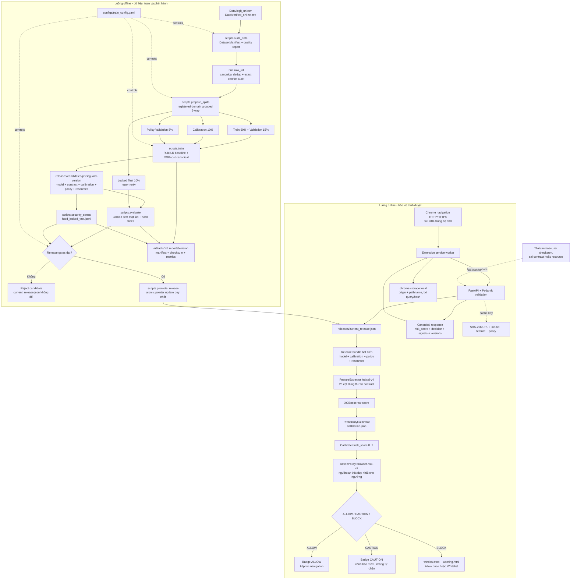

# PhishGuard ML

[](https://github.com/haminhthong/Phishguard-Url-Phishing-Detection/actions/workflows/ci.yml)


> **Tài liệu canonical:** README này mô tả đúng code, cấu hình và release flow hiện
> tại. Metric không ghi cố định trong README; đọc từ report của release tương ứng.

## Bài Toán & Phạm Vi Ứng Dụng (Problem & Scope)

PhishGuard ML là hệ thống phát hiện rủi ro phishing **URL-only**, chạy local-first.
Chrome Extension gửi URL đến FastAPI trên `127.0.0.1`; API trích xuất 25 đặc
trưng `lexical-v4`, chấm điểm bằng XGBoost Native JSON, hiệu chỉnh xác suất và
trả đúng một hành động `ALLOW`, `CAUTION` hoặc `BLOCK`.

Trong phạm vi: phân tích cấu trúc URL, hostname/path/query, IP, Punycode, TLD
đáng ngờ, mạo danh thương hiệu, shortener và mẫu chuyển hướng; đánh giá trên
registered domain chưa từng xuất hiện trong train; cảnh báo qua Chrome Extension.

Ngoài phạm vi: HTML/DOM/JavaScript, file tải xuống, DNS/BGP/TLS, reputation online,
domain hợp lệ đã bị chiếm quyền nhưng URL tự nhiên và phishing zero-day không có
dấu hiệu lexical. Đây là lớp bảo vệ Tier 1, không thay thế antivirus hoặc Safe
Browsing.

### Flowchart duy nhất chi phối toàn bộ dự án

Mọi đường đi production phải kết thúc ở release được promote. Không có fallback
sang model legacy.



### Các bất biến phải giữ

1. Giữ nguyên `raw_url` khi trích xuất feature; `canonical_url` chỉ dùng cho
   deduplication và conflict audit. Cache băm URL đầu vào cùng phiên bản model,
   feature contract và policy; không dùng canonical URL của pipeline dữ liệu.
2. Loại exact canonical conflict nhưng giữ registered domain có cả nhãn legit và
   phishing để bảo toàn hard cases shared-hosting.
3. Năm split không giao nhau theo registered domain và canonical URL.
4. Calibration chỉ fit calibrator; `caution_threshold` và `block_threshold`
   chỉ chọn trên `policy_validation` và nằm duy nhất trong `action_policy.json`.
5. Locked Test không được dùng để chọn model, calibrator hoặc policy.
6. Train/evaluate/stress không đổi production pointer; chỉ `promote_release.py`
   được ghi `releases/current_release.json`.
7. API fail-closed khi thiếu pointer, sai metadata/checksum/resource/contract.

## Cấu Trúc Thư Mục Dự Án (Project Structure)

```text
PhishGuard ML/
├── API/                         # FastAPI routes, release loader, predictor, cache
│   ├── routes/                  # prediction, health, model-info, stats
│   └── services/                # model_loader, predictor, cache
├── Extension/                  # Chrome Manifest V3 worker/content/popup/warning
├── phishguard/                  # thư viện dùng chung cho train và serving
│   ├── calibration/             # ProbabilityCalibrator và ActionPolicy
│   ├── features/                # feature contract, extractor, resources
│   └── training/                # dữ liệu, baseline, metrics
├── scripts/                     # audit, split, train, evaluate, stress, promote
├── configs/train_config.yaml    # version, split, model, policy, release gates
├── resources/                   # brand, shortener, suspicious TLD dictionaries
├── Data/                        # CSV input local
├── evaluation/                  # hard_dev và hard_locked_test JSONL
├── artifacts/                   # audit, manifests, splits, benchmark output
├── releases/                    # runtime: candidates và current pointer
├── reports/                     # runtime: locked test/error/drift reports
├── tests/                       # unit, API, lifecycle, adversarial tests
├── demo/                        # safe_urls.json và suspicious_urls.json
├── notebooks/archive/           # thí nghiệm cũ, không thuộc production flow
├── requirements*.txt            # runtime và dev dependencies
├── CONTRIBUTING.md              # quy tắc đóng góp
├── SECURITY.md                  # threat model và security policy
└── README.md                   # tài liệu canonical
```

`releases/` và `reports/` có thể chưa tồn tại ở checkout mới. Production đọc
bundle được trỏ bởi `releases/current_release.json`. Đã loại bỏ các bản sao model
legacy trong `API/`, `artifacts/` và `artifacts/models/` để tránh chọn nhầm model.
Script `export_model.py` đã được bỏ; dùng pipeline train → evaluate → stress →
promote bên dưới. Báo cáo và split trong `artifacts/` cần tái tạo theo cấu hình
hiện tại trước khi huấn luyện; dữ liệu nguồn vẫn nằm riêng trong `Data/`.

## Hướng Dẫn Cài Đặt & Chạy Thử Nghiệm

### Cài đặt

Yêu cầu Python 3.10+, Chrome/Chromium nếu chạy Extension và `pyarrow` để đọc/ghi
Parquet. Chạy từ thư mục gốc:

```powershell
py -3.10 -m venv .venv
.venv\Scripts\python.exe -m pip install --upgrade pip
.venv\Scripts\python.exe -m pip install -r requirements-dev.txt
```

Linux/macOS dùng tương đương `.venv/bin/python`. Không commit `.env`, URL
phishing đang hoạt động hoặc dữ liệu chứa token/session. API mặc định đọc active
release pointer; chỉ dùng `PHISHGUARD_MODEL_PATH` khi kiểm tra candidate rõ ràng.

### Pipeline

```powershell
# Audit dữ liệu và tạo DatasetManifest/quality report
.venv\Scripts\python.exe -m scripts.audit_data

# Tạo train/validation/calibration/policy_validation/test
.venv\Scripts\python.exe -m scripts.prepare_splits

# Benchmark baseline, refit XGBoost, calibrate, chọn ActionPolicy, freeze candidate
.venv\Scripts\python.exe -m scripts.train

# Locked Test đúng một lần
.venv\Scripts\python.exe -m scripts.evaluate --release-dir releases/candidates/phishguard-4.0.0

# Curated security stress gate
.venv\Scripts\python.exe -m scripts.security_stress --release-dir releases/candidates/phishguard-4.0.0

# Promote atomic sau khi toàn bộ gate đạt
.venv\Scripts\python.exe -m scripts.promote_release --release-dir releases/candidates/phishguard-4.0.0
```

Runner tương đương:

```powershell
.venv\Scripts\python.exe -m phishguard.pipeline run
.venv\Scripts\python.exe -m phishguard.pipeline promote
```

`pipeline run` cố ý dừng sau stress và không promote để người vận hành xem
report. `train`, `evaluate`, `security_stress` không sửa production.

### API và Extension

```powershell
.venv\Scripts\python.exe -m API.main
```

API bind mặc định ở `http://127.0.0.1:5000`. Khi chưa promote, `/health/live`
vẫn báo process sống nhưng `/health/ready`, `/health` và prediction trả 503 do
fail-closed. Sau khi promote, gọi `GET /health/ready`.

Để chạy Extension: mở `chrome://extensions`, bật Developer mode, chọn Load
unpacked và trỏ đến `Extension/`. Extension dùng `POST /v1/score`; route
`/phish-url-prediction` chỉ còn alias tương thích. API offline hiển thị badge
`?`, không tự đánh dấu URL là an toàn.

## Dữ liệu, feature contract và policy

Nguồn chính là `Data/legit_url.csv` và `Data/verified_online.csv`. Audit snapshot
hiện tại ghi 395.356 dòng nguồn, còn 395.034 dòng sạch trên 111.874 registered
domains sau xử lý conflict/duplicate; source of truth là
`artifacts/data_quality_report.json`, `dataset_manifest.json` và
`split_manifest.json`.

Tỷ lệ split cấu hình trong `configs/train_config.yaml`: Train 60%, Validation
15%, Calibration 10%, Policy Validation 5%, Locked Test 10%. Manifest bắt buộc
`domain_overlap = 0` và `canonical_url_overlap = 0`.

`lexical-v4` có 25 cột, đúng thứ tự trong `phishguard/features/contract.py`:

- Lexical: `url_length`, `hostname_length`, `path_length`, `query_length`,
  `url_entropy`, `digit_ratio`, `special_char_ratio`, `dot_count`,
  `hyphen_count`, `at_count`, `path_depth`, `first_directory_length`.
- Host/domain: `subdomain_count`, `hostname_label_count`, `max_label_length`,
  `has_ip_address`, `tld_length`, `domain_length`, `is_suspicious_tld`,
  `has_punycode`.
- Brand: `brand_in_subdomain`, `brand_in_path`,
  `brand_not_registered_domain`.
- Heuristic: `uses_shortening_service`, `has_redirection_pattern`.

V4 giữ số lượng/thứ tự cột nhưng dùng brand matching theo token/hostname label để
tránh false positive như `pineapple.example.com`. Ba resource JSON được copy vào
bundle và xác minh SHA-256.

Rule-based và Logistic Regression chỉ là baseline. XGBoost là model production
canonical duy nhất. Model refit trên Train+Validation; calibrator fit trên
Calibration; ActionPolicy chọn cặp threshold trên Policy Validation. Runtime mapping:

| Score | Risk level | Action | Hành vi |
|---|---|---|---|
| dưới caution | LOW | ALLOW | tiếp tục navigation |
| caution đến dưới block | MEDIUM | CAUTION | cảnh báo mềm |
| từ block trở lên | HIGH | BLOCK | `window.stop` và `warning.html` |

## Artifact, API contract và report

Candidate `releases/candidates/phishguard-<version>/` phải có
`model.json`, `metadata.json`, `feature_contract.json`, `calibration.json`,
`action_policy.json`, `resources/*.json`, manifest, `evaluation.json` và
`security_stress_metrics.json`. `promote_release.py` kiểm tra lineage, checksum,
resource, split overlap, Locked Test và stress trước khi atomic update pointer.

Endpoint canonical:

```http
POST /v1/score
Content-Type: application/json

{"url":"https://example.com/login"}
```

Response gồm `request_id`, `url`, `risk_score`, `decision`
(`action`, `risk_level`, `reason`), `signals`
(`punycode`, `brand_mismatch`, `shortener`, `suspicious_tld`) và
`versions` (`release`, `model`, `feature_contract`,
`feature_contract_hash`, `policy`). Endpoint batch canonical là
`POST /v1/score/batch`, body `{"urls":["https://example.com"]}`, nhận tối đa
50 URL và giữ nguyên thứ tự đầu vào. Alias `/phish-url-prediction` và
`/phish-url-prediction/batch` chỉ để tương thích client cũ. Hệ thống còn có
`/health/live`, `/health/ready`, `/health`,
`/model-info`, `/stats` và `DELETE /cache`.

Report không ghi metric cố định vào README:

- Locked Test: `reports/<model_version>/locked_test_metrics.json`.
- Error analysis: `reports/<model_version>/error_analysis.json`.
- Future-Phishing Unseen-Domain Stress Test: report của
  `scripts.temporal_benchmark`.
- Curated stress: `security_stress_metrics.json` trong candidate.

## Kiểm thử và chất lượng

```powershell
.venv\Scripts\python.exe -m ruff check phishguard API scripts tests
.venv\Scripts\python.exe -m ruff format --check phishguard API scripts tests
.venv\Scripts\python.exe -m unittest discover -s tests -v
node --check Extension\background.js
node --check Extension\content.js
node --check Extension\popup.js
node --check Extension\warning.js
node --check Extension\config.js
```

CI dùng Python 3.11 và Node.js 22, chạy khi push vào main/master, mở pull request
hoặc chạy thủ công bằng workflow_dispatch. Badge phía trên phản ánh lần chạy trên
GitHub; kết quả kiểm thử cục bộ không thay thế trạng thái của GitHub Actions.

Kiểm thử đăng ký route và xác thực URL chạy ngay trên checkout mới. Cả request
đơn và batch từ chối cổng sai, cổng vượt 65535, khoảng trắng bên trong và ký tự
điều khiển; URL IPv6 và khoảng trắng mã hóa `%20` vẫn được giữ nguyên.
Toàn bộ lớp ApiContractTests cần release hợp lệ và bị skip khi chưa promote.
Vì vậy CI xanh ở checkout mới chưa chứng minh luồng dự đoán với model thật đã đạt;
cần chạy lại test sau pipeline/promote để kiểm tra tích hợp đầy đủ.

Chi tiết threat model/privacy nằm trong `SECURITY.md`. Giữ hàm nhỏ, chú thích
tiếng Việt tập trung vào lý do, không đổi thứ tự `FEATURE_COLUMNS` nếu chưa tăng
version/train lại. Mọi thay đổi model phải kèm audit, manifest, checksum và
regression test.
