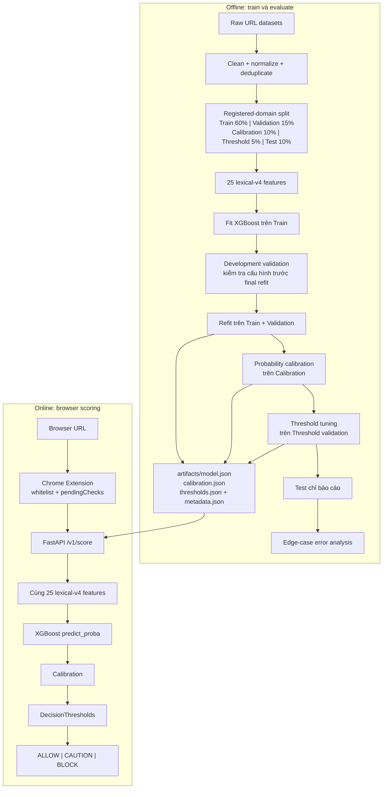

# PhishGuard ML

[](https://github.com/haminhthong/Phishguard-Url-Phishing-Detection/actions/workflows/ci.yml)
[](https://www.python.org/)
[](https://fastapi.tiangolo.com/)
[](https://xgboost.readthedocs.io/)
[](https://developer.chrome.com/docs/extensions/)
[](LICENSE)

PhishGuard ML phát hiện rủi ro phishing từ URL bằng 25 đặc trưng lexical, XGBoost và probability calibration. FastAPI chuyển điểm rủi ro thành ALLOW, CAUTION hoặc BLOCK; Chrome Extension hiển thị hành động ngay khi người dùng điều hướng.

> Phạm vi cố ý hẹp: hệ thống chỉ phân tích chuỗi URL, không crawl HTML, không chạy JavaScript của trang và không gọi reputation API bên ngoài. Đây là bộ lọc rủi ro lexical, không phải cam kết website an toàn tuyệt đối.

## Bài toán và phạm vi ứng dụng

URL phishing thường có hostname dài, nhiều subdomain, IP thay cho domain, Punycode, TLD đáng ngờ, dịch vụ rút gọn, redirect hoặc thương hiệu nằm ngoài registered domain chính thức. Dự án biến các dấu hiệu này thành xác suất phishing và ánh xạ xác suất sang hành vi browser.

| Hạng mục | Quyết định |
|---|---|
| Dữ liệu | Data/legit_url.csv, Data/verified_online.csv |
| Đặc trưng | 25 feature trong contract lexical-v4 |
| Model | XGBClassifier, XGBoost Native JSON |
| Calibration | Isotonic hoặc sigmoid trên tập riêng |
| Quyết định | DecisionThresholds: ALLOW, CAUTION, BLOCK |
| Online | FastAPI local tại 127.0.0.1:5000 |
| Demo | Chrome Extension Manifest V3 |

Manifest hiện có: 395.034 URL sau làm sạch, 111.874 registered domain và 49.448 phishing URL. Các số liệu được sinh bởi script audit/split, không hard-code trong model.

## Luồng logic, luồng data và pipeline duy nhất

Sơ đồ này là quy trình duy nhất chi phối source code, configs/train_config.yaml, artifact và report:



### Data flow offline

phishguard/training/data.py chuẩn hóa URL thành canonical_url, loại URL lỗi, duplicate và exact canonical URL có nhãn mâu thuẫn. Domain có cả legitimate và phishing được giữ lại để phản ánh shared hosting.

split_by_domain() lấy registered domain bằng TLD parser và đưa mỗi domain vào đúng một split. Code bắt buộc domain_overlap == 0 và canonical_url_overlap == 0; random row split không được dùng vì dễ làm metric cao giả tạo.

### Train, calibration và threshold

1. Fit XGBoost trên train.
2. Dùng validation để đánh giá cấu hình; metric được tính trước refit.
3. Fit model cuối trên train + validation; không báo cáo lại validation sau refit.
4. Fit ProbabilityCalibrator trên calibration.
5. Chọn caution_threshold < block_threshold trên threshold_validation, theo constraint FPR/recall trong config.
6. Chỉ chấm test sau cùng; test không tham gia fit, calibration hoặc threshold tuning.

| Điểm sau calibration | Action | Hành vi |
|---:|---|---|
| < caution_threshold | ALLOW | Cho đi tiếp; không khẳng định an toàn |
| caution_threshold .. < block_threshold | CAUTION | Hiển thị cảnh báo mềm |
| >= block_threshold | BLOCK | Gửi cảnh báo chặn |

evaluation/hard_dev.jsonl và evaluation/hard_locked_test.jsonl được chấm trong scripts/evaluate.py, báo cáo tại reports/evaluation.json dưới edge_cases. Đây là error analysis cho brand impersonation, Punycode, shortener, IP, suspicious TLD, shared hosting và benign URL phức tạp; báo cáo không làm dừng pipeline.

## Cấu trúc thư mục

```text
PhishGuard ML/
├── API/
│   ├── main.py, app.py, config.py, dependencies.py, errors.py
│   ├── routes/prediction.py       # /v1/score, /v1/score/batch
│   ├── routes/system.py           # /health
│   └── services/                  # loader và predictor
├── Extension/                     # Manifest V3, background, popup, warning
├── phishguard/
│   ├── features/                  # contract, extractor, resources
│   ├── calibration/               # probability và DecisionThresholds
│   ├── training/                  # clean, split, metrics
│   └── pipeline.py                # audit -> split -> train -> evaluate
├── scripts/                       # audit_data, prepare_splits, train, evaluate
├── configs/train_config.yaml
├── evaluation/, resources/, tests/
├── artifacts/                     # runtime bundle + manifest; splits vẫn local
│   ├── model.json, metadata.json, calibration.json, thresholds.json
│   ├── data_quality_report.json, dataset_manifest.json, split_manifest.json
│   └── splits/                    # sinh khi train, không commit
├── reports/evaluation.json        # test + edge-case error analysis
├── .github/workflows/ci.yml
├── SECURITY.md, README.md, LICENSE
```

## Cài đặt

Yêu cầu Python 3.11+ và Node.js 22+ cho extension/CI. Runtime API dùng được ngay với bốn file trong artifacts/; CSV chỉ cần khi muốn tái tạo pipeline train.

```powershell
py -3.11 -m venv .venv
.\\.venv\\Scripts\\Activate.ps1
python -m pip install --upgrade pip
python -m pip install -r requirements.txt
```

Khi chạy lại pipeline, cài thêm dependency phát triển và đặt dữ liệu vào:

```powershell
python -m pip install -r requirements-dev.txt
```

```text
Data/
├── legit_url.csv
└── verified_online.csv
```

Cột URL được hỗ trợ là url hoặc raw_url. Script tự gắn nhãn theo nguồn dữ liệu; không commit dữ liệu thật, URL đang hoạt động hoặc secret.

## Chạy pipeline

```powershell
python -m scripts.audit_data
python -m scripts.prepare_splits
python -m scripts.train
python -m scripts.evaluate
```

Hoặc chạy toàn bộ:

```powershell
python -m phishguard.pipeline run
```

Output chính gồm data_quality_report.json, dataset_manifest.json, split_manifest.json, model.json, metadata.json, calibration.json, thresholds.json và reports/evaluation.json. training_report.json và source_bias_report.json chỉ là báo cáo sinh cục bộ.

API chỉ đọc model.json, metadata.json, calibration.json và thresholds.json trong artifacts/. Đây là nguồn model duy nhất của runtime và bốn file này được giữ trong repository để clone mới có thể chạy API mà không cần raw data.

Báo cáo đánh giá hiện tại: [reports/evaluation.json](reports/evaluation.json).

## API và Chrome Extension

Khởi động:

```powershell
python -m API.main
Invoke-RestMethod http://127.0.0.1:5000/health
Invoke-RestMethod -Method Post -Uri http://127.0.0.1:5000/v1/score -ContentType 'application/json' -Body '{"url":"https://example.com/login"}'
```

| Method | Path | Chức năng |
|---|---|---|
| GET | /health | Kiểm tra model, 25 feature và calibration |
| POST | /v1/score | Chấm một URL |
| POST | /v1/score/batch | Chấm 1–50 URL, giữ thứ tự |

Response gồm request_id, url, risk_score, action, risk_level, reason, bốn signals lexical và model_version. API từ chối scheme không phải HTTP/HTTPS, hostname lỗi, whitespace, URL trên 2.048 ký tự hoặc batch quá 50 phần tử.

Load Extension/ từ chrome://extensions bằng Developer mode → Load unpacked. Extension gửi URL đầy đủ để giữ tín hiệu path/query khi scoring, nhưng chỉ lưu origin + pathname vào lịch sử. Whitelist bỏ qua domain đã chọn; pendingChecks ngăn response cũ ghi đè URL mới. API offline hiển thị badge ? và Protection unavailable, không giả định ALLOW.

## Kiểm thử và CI

```powershell
python -m ruff check phishguard API scripts tests
python -m ruff format --check phishguard API scripts tests
python -m unittest discover -s tests -v
python -m json.tool Extension/manifest.json > $null
node --check Extension/background.js
node --check Extension/content.js
node --check Extension/popup.js
node --check Extension/warning.js
node --check Extension/config.js
```

GitHub Actions thực hiện: cài dependency → `pip check` → Ruff lint/format → runtime artifact contract → unit/integration tests → manifest JSON → JavaScript syntax → boot API và smoke test `/health`, `/v1/score`. CI không phụ thuộc deploy, registry hay dịch vụ mạng.

## Giới hạn và bảo mật

- URL lexical bình thường nhưng website đã bị chiếm quyền có thể không bị phát hiện.
- Không crawl HTML nên không thấy form, script, redirect sau khi mở trang hoặc brand chỉ xuất hiện trong nội dung.
- Edge-case report dùng để phân tích false positive/false negative, không che giấu bằng nhãn PASS/FAIL.
- Model lỗi hoặc thiếu artifact khiến API trả 503; hệ thống không trả ALLOW giả.
- Chi tiết privacy, threat model và responsible usage: SECURITY.md.
