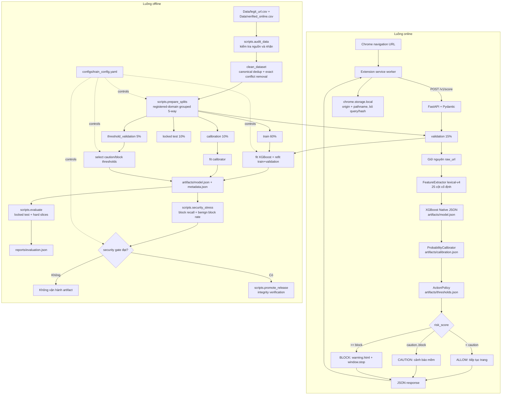

# PhishGuard ML

[](https://github.com/haminhthong/Phishguard-Url-Phishing-Detection/actions/workflows/ci.yml)


PhishGuard ML là hệ thống phát hiện rủi ro phishing theo URL, chạy local-first. Chrome Extension gửi URL đến FastAPI trên `127.0.0.1`; API dùng đúng một feature contract `lexical-v4`, XGBoost Native JSON, calibrator và `ActionPolicy` để trả `ALLOW`, `CAUTION` hoặc `BLOCK`.

README này là tài liệu canonical: mọi đường dẫn, tên artifact, endpoint và lệnh bên dưới phải khớp source hiện tại.

## Bài Toán & Phạm Vi Ứng Dụng (Problem & Scope)

### Trong phạm vi

- Phân tích cấu trúc URL: độ dài, entropy, ký tự đặc biệt, path/query, IP, Punycode, suspicious TLD và mẫu chuyển hướng.
- Nhận diện mạo danh thương hiệu trong subdomain/path bằng dictionary local.
- Chấm điểm URL trong bộ nhớ, không gọi DNS, Whois, Safe Browsing hay dịch vụ reputation bên ngoài.
- Chia dữ liệu theo `registered_domain` để đánh giá unseen-domain và tránh leakage.
- Cảnh báo trong Chrome Extension bằng ba hành động thống nhất.

### Ngoài phạm vi

Hệ thống không phân tích HTML/DOM/JavaScript, file tải xuống, DNS/BGP/TLS, nội dung trang, domain hợp lệ đã bị chiếm quyền nhưng có URL tự nhiên, hoặc phishing zero-day không có dấu hiệu lexical. Đây là lớp bảo vệ URL tier 1, không thay thế antivirus hay Safe Browsing.

## Luồng logic, luồng data và pipeline kỹ thuật

Flowchart dưới đây là quy trình duy nhất chi phối mã nguồn, cấu hình, artifact và báo cáo. `raw_url` chỉ dùng để tạo feature; `canonical_url` chỉ dùng làm khóa dedup/conflict và kiểm tra leakage.



Các bất biến quan trọng:

1. Không trích xuất feature từ URL đã canonicalize; query và fragment của `raw_url` được giữ khi tính feature.
2. Exact canonical conflict bị loại; domain có URL legit và phishing khác nhau được giữ lại rồi gán nguyên domain vào một split.
3. Năm split không giao nhau theo `registered_domain` và `canonical_url`; locked test không tham gia fit/calibration/threshold.
4. Threshold chỉ được chọn ở `threshold_validation`; API không tự suy ra ngưỡng từ request.
5. API fail-closed khi thiếu model, metadata, calibration, threshold, checksum hoặc resource contract.

## Cấu Trúc Thư Mục Dự Án (Project Structure)

```text
PhishGuard ML/
├── API/                         # FastAPI app, validation, loader, predictor
├── Extension/                  # Chrome Manifest V3: background/content/popup/warning
├── phishguard/
│   ├── features/                # lexical-v4 contract, extractor, resources
│   ├── calibration/             # probability calibrator và ActionPolicy
│   └── training/                # cleaning, grouped split, metrics, baseline
├── scripts/
│   ├── audit_data.py            # audit nguồn dữ liệu
│   ├── prepare_splits.py       # tạo 5 split domain-disjoint
│   ├── train.py                 # tạo artifact trực tiếp trong artifacts/
│   ├── evaluate.py              # locked test và hard slices
│   ├── security_stress.py       # security gate
│   ├── evaluate_edge_cases.py   # báo cáo edge-case bổ sung
│   └── promote_release.py      # kiểm tra integrity/gate, không tự ghi pointer
├── configs/train_config.yaml    # seed, tỷ lệ split, model, calibration, thresholds
├── resources/                   # brand, shortener, suspicious TLD dictionaries
├── Data/                        # dữ liệu CSV local, không commit dữ liệu nhạy cảm
├── evaluation/                  # hard_dev và hard_locked_test JSONL
├── artifacts/                   # model, metadata, calibration, thresholds, split reports
├── reports/                     # báo cáo đánh giá sinh ra khi chạy pipeline
├── tests/                       # unit, data leakage, API contract, adversarial tests
├── requirements*.txt
├── SECURITY.md
├── LICENSE
└── README.md
```

`artifacts/` và `reports/` có thể chưa có model mới trong checkout sạch. Không commit model binary/pickle; model runtime phải là XGBoost Native JSON được tạo bởi `scripts.train`.

## Hướng Dẫn Cài Đặt & Chạy Thử Nghiệm

Yêu cầu Python 3.10+, Node.js 22 cho kiểm tra Extension và dữ liệu local gồm:

- `Data/legit_url.csv` có cột `url`.
- `Data/verified_online.csv` có cột `url`; có thể có thêm `submission_time` nhưng pipeline canonical không dùng temporal split.

```powershell
py -3.10 -m venv .venv
.venv\Scripts\python.exe -m pip install --upgrade pip
.venv\Scripts\python.exe -m pip install -r requirements-dev.txt
```

Chạy từng bước:

```powershell
.venv\Scripts\python.exe -m scripts.audit_data
.venv\Scripts\python.exe -m scripts.prepare_splits
.venv\Scripts\python.exe -m scripts.train
.venv\Scripts\python.exe -m scripts.evaluate
.venv\Scripts\python.exe -m scripts.security_stress --release-dir releases\candidates\phishguard-4.0.0
.venv\Scripts\python.exe -m scripts.promote_release --release-dir releases\candidates\phishguard-4.0.0
```

Hoặc dùng runner:

```powershell
.venv\Scripts\python.exe -m phishguard.pipeline run
```

`scripts.train` ghi model canonical vào `artifacts/` và đồng thời tạo candidate bundle để các security gate kiểm tra. `scripts.promote_release` chỉ xác minh integrity/gate; không tự thay đổi production pointer.

Khởi động API:

```powershell
.venv\Scripts\python.exe -m API.main
```

API chạy tại `http://127.0.0.1:5000`. `GET /health/live` chỉ kiểm tra process; `GET /health` và endpoint score cần bộ artifact hợp lệ. Extension: mở `chrome://extensions`, bật Developer mode, chọn Load unpacked và trỏ vào `Extension/`.

## Feature contract, model và policy

`lexical-v4` có 25 cột cố định trong `phishguard/features/contract.py`:

```text
url_length, hostname_length, path_length, query_length, url_entropy,
digit_ratio, special_char_ratio, dot_count, hyphen_count, at_count,
path_depth, first_directory_length, subdomain_count, hostname_label_count,
max_label_length, has_ip_address, tld_length, domain_length,
is_suspicious_tld, has_punycode, brand_in_subdomain, brand_in_path,
brand_not_registered_domain, uses_shortening_service, has_redirection_pattern
```

Model production là XGBoost. Rule-based/Logistic Regression chỉ là baseline nghiên cứu nếu được gọi độc lập. Calibrator fit trên calibration; policy chọn cặp threshold trên threshold validation; test chỉ dùng để báo cáo.

| Điều kiện score | Action | Hành vi Extension |
|---|---|---|
| `< caution_threshold` | `ALLOW` | cho phép điều hướng |
| `caution_threshold <= score < block_threshold` | `CAUTION` | cảnh báo mềm |
| `>= block_threshold` | `BLOCK` | dừng trang và mở warning |

## API contract

```http
POST /v1/score
Content-Type: application/json

{"url":"https://example.com/login"}
```

`POST /v1/score/batch` nhận `{"urls":[...]}`, tối đa 50 URL và giữ thứ tự. Response đơn gồm `request_id`, URL đầu vào, `risk_score`, `decision`, bốn `signals` lexical và `versions` gồm model, contract, contract hash, policy. Không có response field `cached` và không có route alias cũ.

Endpoint hệ thống: `GET /health/live`, `GET /health/ready`, `GET /health`, `GET /model-info`. URL phải là HTTP/HTTPS, có hostname, port hợp lệ, dài không quá 2.048 ký tự và không chứa whitespace/ký tự điều khiển.

## Kiểm thử và CI

```powershell
.venv\Scripts\python.exe -m ruff check phishguard API scripts tests
.venv\Scripts\python.exe -m ruff format --check phishguard API scripts tests
.venv\Scripts\python.exe -m unittest discover -s tests -v
node --check Extension\background.js
node --check Extension\content.js
node --check Extension\popup.js
node --check Extension\warning.js
node --check Extension\config.js
```

GitHub Actions chạy trên Python 3.11 và Node.js 22 khi push, pull request hoặc `workflow_dispatch`: lint, format, unit/integration tests, manifest JSON và cú pháp Extension. Test API tích hợp tự skip khi checkout chưa có artifact; điều này tránh CI xanh giả rằng model production đã được train.

## Giới hạn và bảo mật

URL có thể chứa token/session trong query. Extension chỉ lưu `origin + pathname` vào `chrome.storage.local`; API không ghi URL đầy đủ vào log. Không dùng pickle/joblib. Artifact được kiểm tra SHA-256 và feature/resource contract trước khi serving. Xem [SECURITY.md](SECURITY.md) để biết threat model và cách báo cáo lỗ hổng.

## License

MIT — xem [LICENSE](LICENSE).
